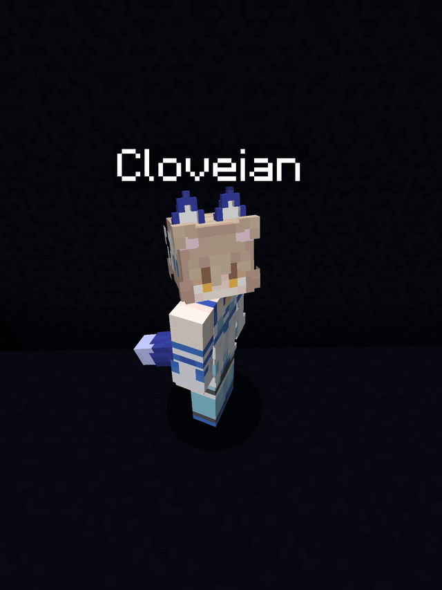
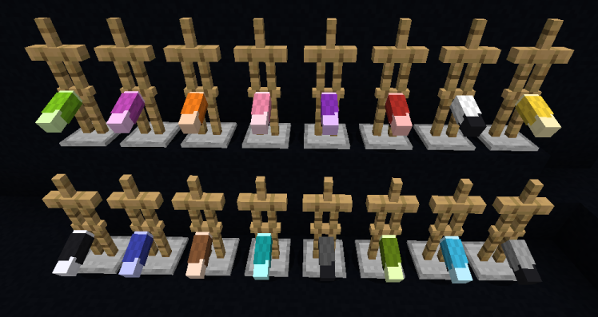
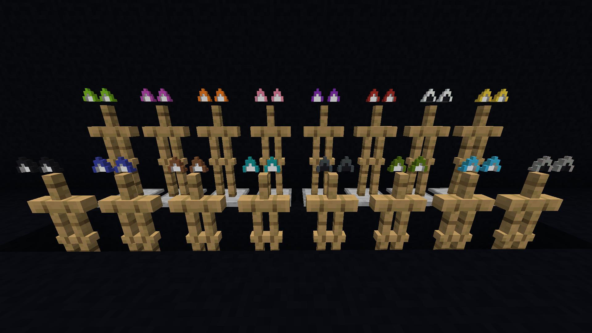
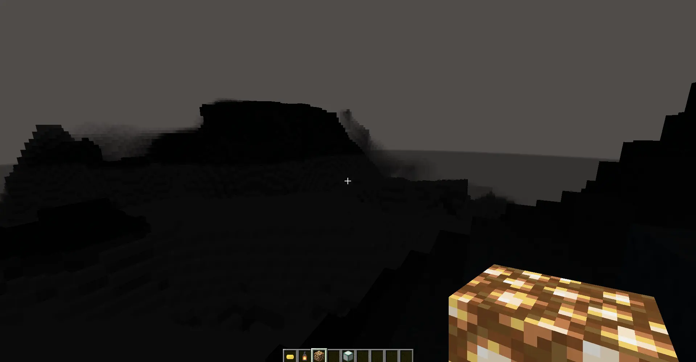

# Create: MelatOwOin

A port of [Melatonin(Create)](https://modrinth.com/mod/createmelatonin) by Alos2019, ported to fabric (and 100% untested forge). Maintained\* by Cloveian :3
Adds cat ears, chloroform, definitely legal pills, and other chaos-enabling items to Create.
Actively in development — expect major content updates!! >w<

---

## What's in this mod? :3

### Cat Ears & Tails >w<
16 dye colors of wearable cat ears (helmet slot) and cat tails (leggings slot) UwU
Crafted from High Quality Fabric and Plastic.

> tip: you can get fur by right-clicking a cat with a brush :3

---

### Chloroform >w<
A full Create-style production line for chloroform. Don't ask what it's for. >:3c

*make people eepy*

---

### Throwable Stuff
- **Throwable Orange Sauce** — throw at friends to make them furries. Comes with Curse of Binding :3
- **Throwable Cyan Sauce** — consequences pending >w<

---

### Pills UwU
Cyan Pill, Orange Pill. Definitely legal. Definitely. :3

*(yummy screenshot)*

---

### The Eepy Effect zzz...
Experience the consequences of your actions by being forever trapped in a dark abyss >///<
The og creator has been trapped there for 3 months. (They asked that i *"Please send help."* I might... or maybe not >:3)

---

## Getting Started :3

| Item | How |
|------|-----|
| High Quality Fabric | Create processing chain (see JEI) |
| Plastic | Crafting table (see JEI) |
| Anything else | (see JEI) |

---

## Dependencies

- [Create](https://modrinth.com/mod/create-fabric) (Fabric) / [Create](https://modrinth.com/mod/create) (Forge)
- Fabric API (Fabric only)

### Optional
- [Accessories](https://modrinth.com/mod/accessories) — wear ears and tails in accessory slots instead of armor slots :3

---

## License
Apache-2.0

**Original mod (Melatonin(Create)) by [Alos2019](https://modrinth.com/user/Alos2019)** UwU
**Ported and maintained as Create: Melatonin by Cloveian** :3
